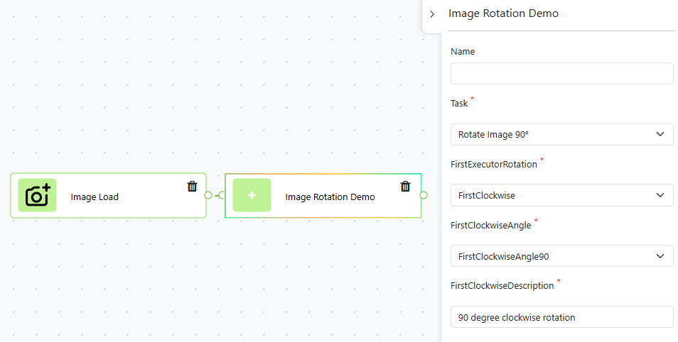
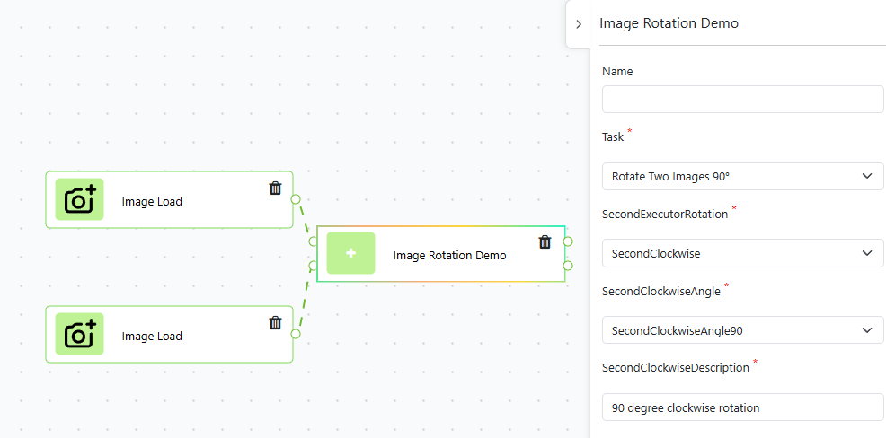
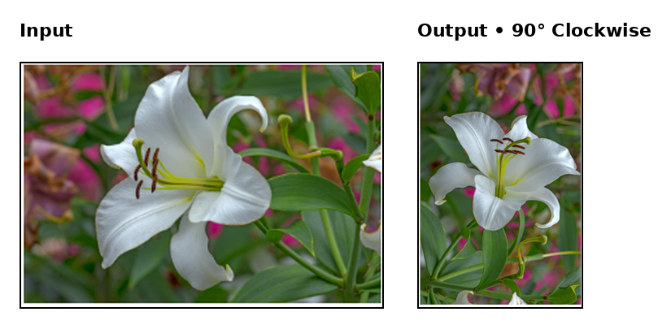

# Image Rotation Demo for NovaVision

**Image Rotation Demo** is a NovaVision component package that demonstrates multiple executors and configurable image rotation.

The package consists of two executors:

## 1. Rotate Image

The **Rotate Image** executor takes one input image and produces one output image.

**Input:** `inputImage`

**Output:** `outputImage`



## 2. Rotate Two Images

The **Rotate Two Images** executor takes two input images and produces two output images.

**Inputs:**
- `inputImage`
- `inputImage2`

**Outputs:**
- `outputImage`
- `outputImage2`



## Rotation Configuration

Both executors use a `dependentDropdownlist` named `Rotation`.

The configuration has two options:

- `Clockwise`
- `Counterclockwise`

Each option contains two different field types:

- `Angle`: `dropdownlist` with `90°` and `180°` options
- `Description`: `textInput`

```text
Rotation
├── Clockwise
│   ├── Angle → dropdownlist
│   └── Description → textInput
│
└── Counterclockwise
    ├── Angle → dropdownlist
    └── Description → textInput
```

The selected rotation direction and angle are applied to the input image or images.

## Rotation Example

The following example shows a 90° clockwise rotation.



## Process Flow

### Rotate Image

1. The input image is loaded.
2. The selected rotation configuration is read.
3. The image is rotated according to the selected direction and angle.
4. The rotated image is returned as `outputImage`.

### Rotate Two Images

1. Two input images are loaded.
2. The selected rotation configuration is read.
3. The same rotation configuration is applied to both images.
4. Both rotated images are returned as outputs.

## Package Structure

```text
IremPackage/
├── src/
│   ├── executors/
│   │   ├── FirstExecutor.py
│   │   └── SecondExecutor.py
│   ├── models/
│   │   └── PackageModel.py
│   └── utils/
│       └── response.py
```