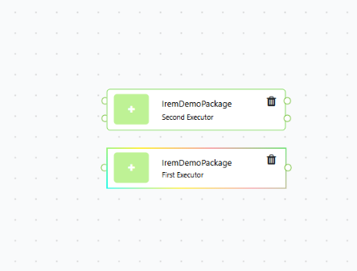

# Irem Package

> A NovaVision package demonstrating a multi-executor structure with image inputs/outputs and dependent dropdown configurations.

**Category:** Utility

**Status:** Experimental

**Last Updated:** 22.09.2026

---

## 1. Overview

Irem Package is a NovaVision package developed to demonstrate a multi-executor package structure. The package contains two independent executors with different input/output requirements and dependent dropdown configurations.

The first executor accepts one image and produces one image output, while the second executor accepts two image inputs and produces two image outputs. The package also demonstrates dependent dropdown options containing different UI field types.

**Typical use cases:**

- Demonstrating a package with multiple executors in NovaVision.
- Testing image input and output connections in a Flow.
- Demonstrating dependent dropdown configurations with different field types.



---

## 2. Inputs

| Field Name | Kind/Type | Required | Default | Description |
|---|---|---|---|---|
| `inputImage` | `Image / list[Image]` | Yes | — | Image input used by the First Executor. |
| `inputImage2` | `Image / list[Image]` | Yes | — | Second image input used by the Second Executor. |

The `inputImage` field accepts either a single `Image` object or a list of `Image` objects.

The `inputImage2` field follows the same structure and accepts either a single `Image` object or a list of `Image` objects.

---

## 3. Configuration Parameters

| Parameter | Type | Field Type (UI control) | Allowed Values / Range | Default | Description |
|---|---|---|---|---|---|
| `Mode` | `object` | `dependentDropdownlist` | `Basic`, `Advanced` | — | Selects the configuration option for the executor. |
| `Basic.Text` | `string` | `textInput` | Free text | — | Text value available under the Basic option. |
| `Basic.Number` | `object` | `dropdownlist` | `One`, `Two` | — | Selects between the numeric options 1 and 2. |
| `Advanced.Language` | `string` | `textInput` | Free text | — | Language value available under the Advanced option. |
| `Advanced.Enabled` | `object` | `dropdownlist` | `Enabled`, `Disabled` | — | Selects the boolean enabled state. |

The package implements the required `dependentDropdownlist` configuration for both executors.

Each executor provides two dependent dropdown options:

- **Basic**
  - `Text` → `textInput`
  - `Number` → `dropdownlist`

- **Advanced**
  - `Language` → `textInput`
  - `Enabled` → `dropdownlist`

The same configuration structure is implemented independently for both executors.

---

## 4. Outputs

| Field Name | Kind/Type | Description |
|---|---|---|
| `outputImage` | `Image / list[Image]` | Image output produced by the First Executor. |
| `outputImage2` | `Image / list[Image]` | Second image output produced by the Second Executor. |

The First Executor receives `inputImage` and returns it through `outputImage`.

The Second Executor receives `inputImage` and `inputImage2` and returns them through `outputImage` and `outputImage2`, respectively.

---

## 5. Use Case Examples

**Use case 1: Single Image Flow**

An image source provides an image to the `First Executor` through the `inputImage` input. The executor receives the image and returns it through `outputImage`, which can then be consumed by another package or component in the Flow.

**Use case 2: Two Image Flow**

Two image sources provide `inputImage` and `inputImage2` to the `Second Executor`. The executor returns the corresponding images through `outputImage` and `outputImage2`, which can then be connected to subsequent components in the Flow.

**Use case 3: Executor Configuration Demonstration**

The package can be used to demonstrate a multi-executor NovaVision package. The user can select between `First Executor` and `Second Executor` and configure each executor using its corresponding dependent dropdown options.

---

## 6. Limitations and Notes

- The package is primarily a demonstration of the NovaVision multi-executor package structure and configuration system.
- The executors currently pass the received image data to their corresponding outputs rather than performing a computer vision transformation.
- `inputImage` and `inputImage2` accept either a single image or a list of images.
- The package requires the NovaVision SDK/runtime environment for execution.
- The package was validated for Python syntax using `python -m compileall src`.
- During Flow integration, the NovaVision platform reported the following error while resolving images for the active executor:

```text
No images found for active executor: FirstExecutor in package: IremPackage